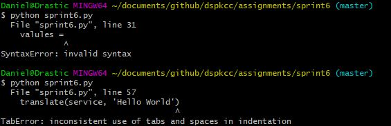
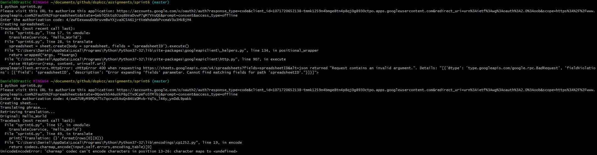
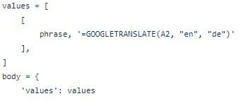

  For my last sprint I wasn't sure what to do/ could do as I had some issues in previous assignments with steps that were either hard to grasp or
or wasn't executed properly because of diffrent OS commands. I decided to make a project on API with google Oauth and coding it in python. 
I didn't fully understand the last API assignment and it took me awhile to figure out OSS so I wanted my last project to help me understand these
important points. I'm doing a google sheets translation of English into Khmer. 
  
  Many visits to stackoverflow were made along with visits to 
articles about APIs. Some issues that came up when making my project was not defineing my OS...which shoudl've been obvious but I hadn't spent 
much time with python. After establishing my connection to the API I spent a couple days on the translation part of my project. I actually spent about 30mins
looking for the tag for my selected language in inspect element before I realized... I could just google it. English = en, Khmer = km. Besides the part about 
forgetting to define my OS I also found out python doesn't like using TAB for spacing, luckily in my editor I could replace my TABs with space.
My old habits of coding also had to change, I usually have a lot of spacing and indention in my code to make it readable but it seems in python
it doesn't like blank spaces after some characters. Easily solved by moving some brackets so no big deal.

The last issues I came across took my awhile of reading the error to figure out what was wrong. From what I can tell python also has an issue 
withword wrapping(?) and my language codec. The first issue still stumps me because a word wrapping issue sounds weird to me and it was one
of those codding moments were I just retyped the line and it worked...I'll have to look into it more later. As for the codec issue I correctly assumed
that it was because I did not have to correct language codec to display khmer letters. Instead of installing another codec I decided to just change the
language from Khmer to German. 

At the very least I can say I understand python better after this. Not sure what I'll do for sprint7 besides streamlining the google authorization. As is
I have to copy paste a code from a link the project gives.
