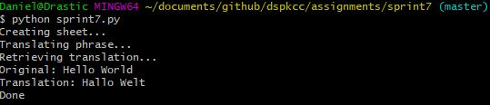
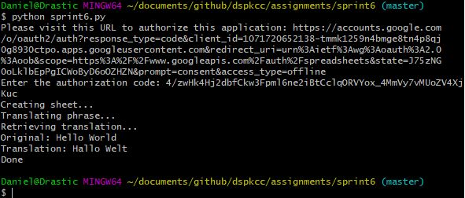

# Google Sheets API Translator

Make/have a google account

Go to this link and Enable Google sheets API

```
https://developers.google.com/sheets/api/quickstart/python
```

Go to project directory and run this line

```
pip install --upgrade google-api-python-client google-auth-httplib2 google-auth-oauthlib
```

Run project file

```
python sprint7.py
```



If it does not run automatically the first time  follow the on screen prompts and when run again it should now have a token to run automatically


