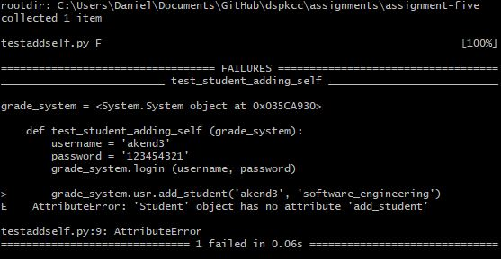
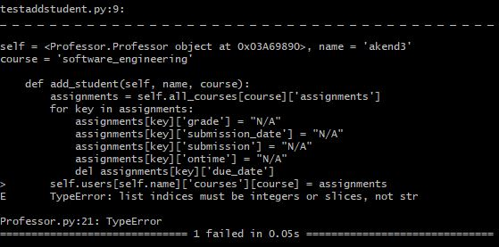
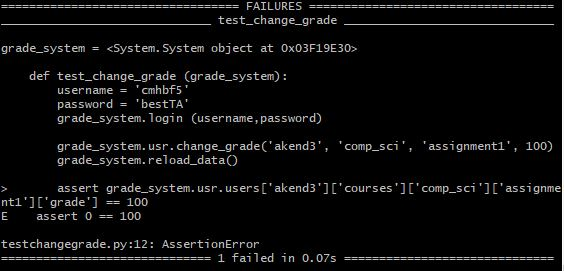

# Assignment 5: Software-Engineering-Testing

[Setup your python virtual environment first.](./venv.md)

For this assignment you will be tasked with testing the grading system. This system was designed to be a simple version 
of the grading system you have worked on for the past assignments. 

This program contains the following classes:
- System
- User
- Staff
- Student
- TA
- Professor

## SetUp

Run `pip3 install pytest` in order to run a test.

## Files

### Data
There are two json files with all the user and course information. This information would typically be stored in an actual
database but were stored in "Data/users.json" and "Data/courses.json" to help simplify this assignment.

### Restore Data
Everytime you modify the code, the data will be changed. Run RestoreData.py to restore the json files to the original
dataset.

### System
This is the main class which is used to manage the entire software. Below this class has `if '__name__' == '__main__':` statement 
which contains the first lines run in a python program.

System manages and creates the different users within the system.

### User

This class contains the functions used by all other classes. Staff, and Student both directly inherit the functions in this class.

### Staff

This class contains the functions used by both Professor and TA.

### Student
Student inherits users and contains the functions relevant to the activities the students can perform.

### TA
TA inherits Staff and contains all the relevant functions that the TA can perform.

### Professor
Professor inherits Staff and contains all functions relevant to acitvities the professor can perform.

### Example_Test.py
This is an example test. It tests if the system can handle a username that does not exist. To run this test run:

`pytest` or `pytest example_test.py`

in the directory with the test. This will run all python files containing '_test' or 'test_'.

When the program is run, it then looks for test functions within the file. In this case we have 'test_login'. This
function utilizes a fixture which loads any important data into the system prior to the test. Grading_system is the
fixture used to create the gradingSystem object and load all the data.

The function then attempts to login with a username that is not real. If the attempt is successful without any errors then the test should
pass. If there is no error handling then the test will fail. This test fails because the function cannot handle the 
KeyError. This error occurs when a bad key is entered into a dictionary.

## Assignment

For this assignment you will need to use Pytest to write tests for the software we have provided. You will need to have 
15 total tests and I should be able to run them on my system. For the first 10 tests I have chosen exactly what to test
for. Five of these should pass and five of these should fail.

For the last five tests, you will choose what to test for on your own. Design theses tests so that all five of them
will fail. Think of things that a program like this might need to have. For instance, are there any limitations a 
username or password should have when logging in? Are there any restrictions on which professors can add students to 
certain courses? 

Here are the first 10 tests you will need to create:

### 1. login - System.py

The login function takes a name and password and sets the user for the program. Verify that the correct user is created
with this test, and use the json files to check that it adds the correct data to the user.

### 2. check_password - System.py

This function checks that the password is correct. Enter several different formats of passwords to verify that the 
password returns correctly if the passwords are the same.

### 3. change_grade - Staff.py

This function will change the grade of a student and updates the database. Verify that the correct grade is changed on 
the correct user in the database.

### 4. create_assignment Staff.py

This function allows the staff to create a new assignment. Verify that an assignment is created with the correct due date
in the correct course in the database.

### 5. add_student - Professor.py

This function allows the professor to add a student to a course. Verify that a student will be added to the correct course
in the database.

### 6. drop_student Professor.py

This function allows the professor to drop a student in a course. Verify that the student is added and dropped from the correct course
in the database.

### 7. submit_assignment - Student.py

This function allows a student to submit an assignment. Verify that the database is updated with the correct assignment, 
submission, submission dateand in the correct course.

### 8. check_ontime - Student.py

This function checks if an assignment is submitted on time. Verify that it will return true if the assignment is on time,
and false if the assignment is late.

### 9. check_grades - Student.py

This function returns the users grades for a specific course. Verify the correct grades are returned for the correct user.

### 10. view_assignments - Student.py

This function returns assignments and their due dates for a specific course. Verify that the correct assignments for the
correct course are returned.

## Grading 

We will run `pytest` in the directory with your tests. Please make sure that you remove both the example tests from 'PythonTutorial/Classes/example_test.py' and just 'example_test.py'. We will be looking for 5 total tests that pass and 10 total tests that fail. We will then review the code for each test to assure you created the tests correctly. You will be marked off for each test that does not work.
