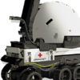
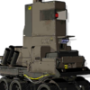

# A quick reference for operators that are only obtainable through recruitment 

## _Operators will be separated by rarity, the tags required to recruit them along with an image will be provided along with a link with more detail on the Operator_

## Table of Contents
- ### [1 Star Operators](#s1--1)
- ### [2 Star Operators](#s2--1)

  
---
  

### 1 Star Operators
---
 - **[Lancet-2](https://mrfz.fandom.com/wiki/Lancet-2)**
* Recruitment Tags:
  * Medic, Ranged, Healing, Robot

 - **[Castle-3](https://mrfz.fandom.com/wiki/Castle-3)**
* Recruitment Tags:
  * Guard, Melee, Support, Robot
### 2 Star Operators
---
 - **[12F](https://mrfz.fandom.com/wiki/12F)**
* Recruitment Tags:
  * Caster, Ranged, Melee
