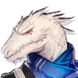

# A quick reference for operators that are only obtainable through recruitment 

## _Operators will be separated by rarity, the tags required to recruit them along with an image will be provided along with a link with more detail on the Operator_

## Table of Contents
- ### [1 Star Operators](#s1--1)
- ### [2 Star Operators](#s2--1)

## Changelog (4/14/2020)

- Added Lancet-2, Castle-3, 12F, Noir Corne, Durin, Yato, Rangers, Adnachiel, Estelle, Indra, Vulcan
  
---
  

### 1 Star Operators
---
 - **[Lancet-2](https://mrfz.fandom.com/wiki/Lancet-2)**
* Recruitment Tags:
  * Medic, Ranged, Healing, Robot

 - **[Castle-3](https://mrfz.fandom.com/wiki/Castle-3)**
* Recruitment Tags:
  * Guard, Melee, Support, Robot
### 2 Star Operators
---
 - **[12F](https://mrfz.fandom.com/wiki/12F)**
* Recruitment Tags:
  * Caster, Ranged, Starter
  
 - **[Noir Corne](https://mrfz.fandom.com/wiki/Noir_Corne)**
* Recruitment Tags:
  * Defender, Melee, Starter
  
 - **[Durin](https://mrfz.fandom.com/wiki/Durin)**
* Recruitment Tags:
  * Caster, Ranged, Starter

 - **[Yato](https://mrfz.fandom.com/wiki/Yato)**
* Recruitment Tags:
  * Vanguard, Melee, Starter
  
 - **[Rangers](https://mrfz.fandom.com/wiki/Rangers)**
* Recruitment Tags:
  * Sniper, Ranged, Starter
  
### 3 Star Operators
---
 - **[Adnachiel](https://mrfz.fandom.com/wiki/Adnachiel)**
* Recruitment Tags:
  * Sniper, Ranged, DPS
  
### 4 Star Opeerators
---
 - **[Estelle](https://mrfz.fandom.com/wiki/Estelle)**
* Recruitment Tags:
  * Guard, Melee, AoE, Survival
  
### 5 Star Operators
---
 - **[Indra](https://mrfz.fandom.com/wiki/Indra)**
* Recruitment Tags:
  * Senior, Guard, Melee, DPS, Survival
  
 - **[Vulcan](https://mrfz.fandom.com/wiki/Vulcan)**
* Recruitment Tags:
  * Senior, Defender, Melee, Survival, Defense, DPS
